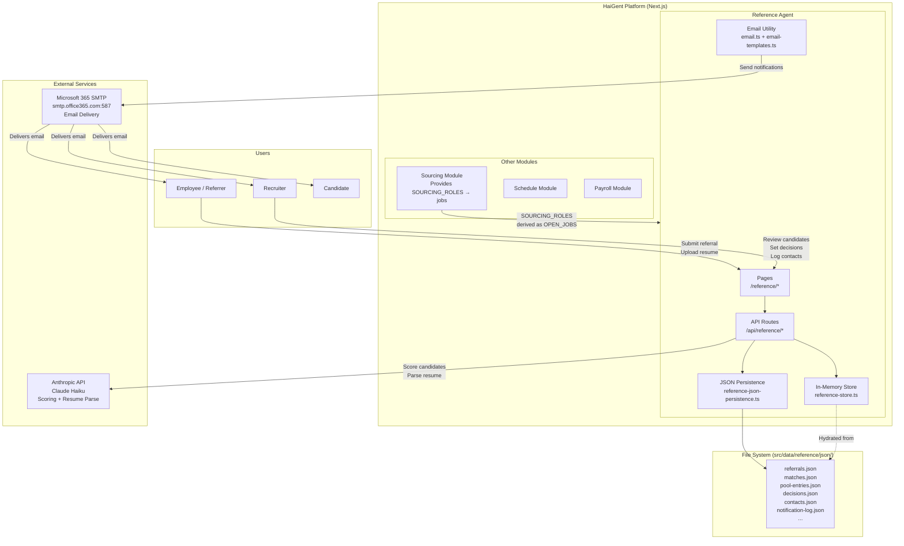
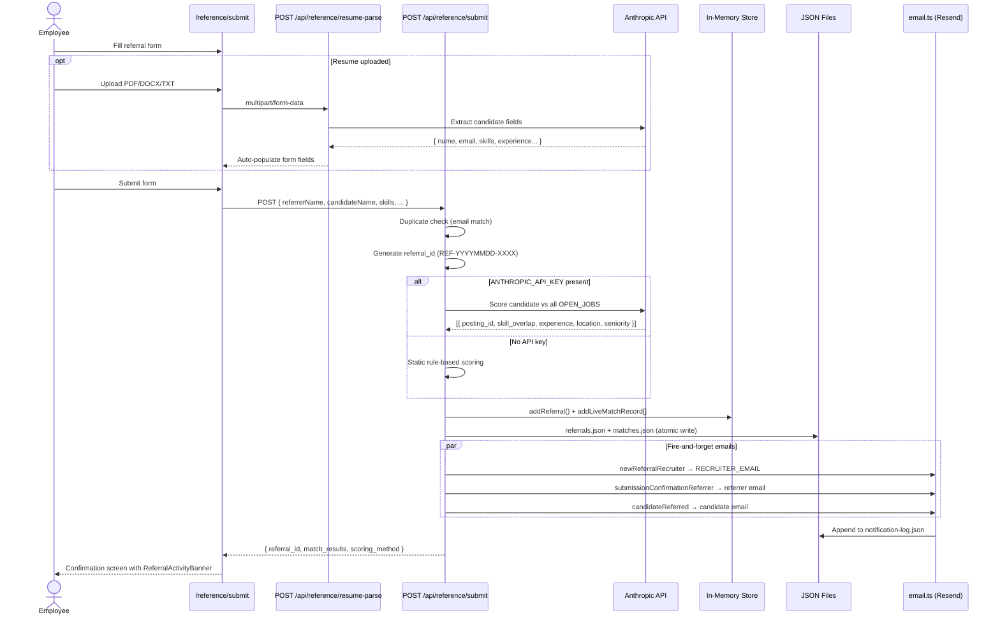
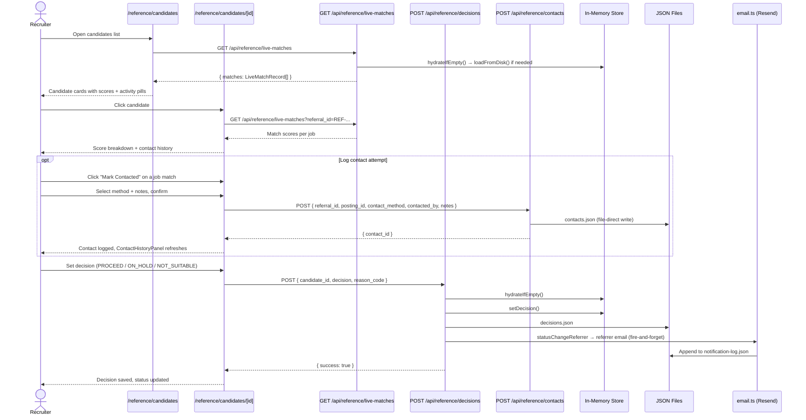
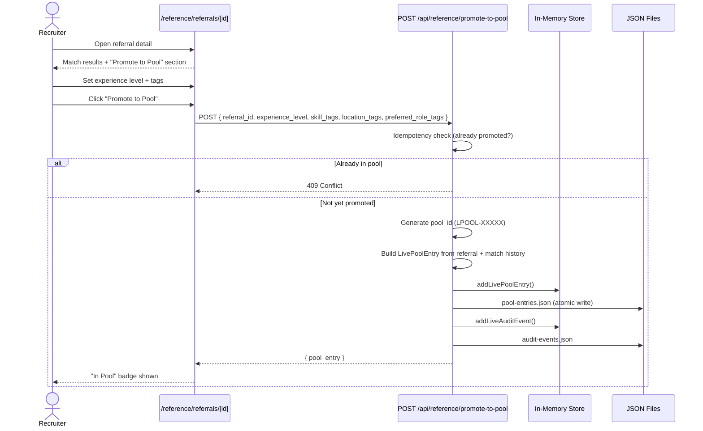
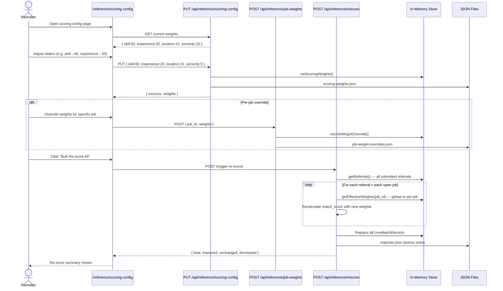
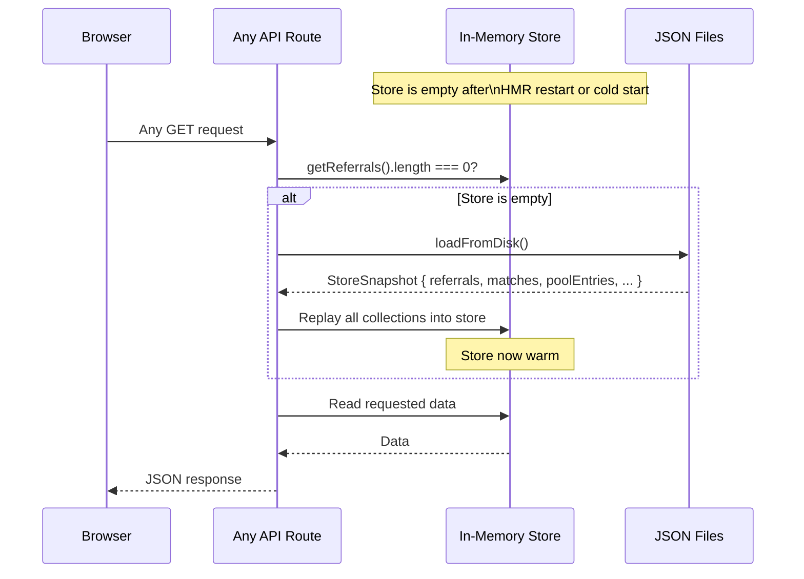

# Reference Agent — Technical Design

## Architecture Overview

The Reference Agent follows a layered architecture within a Next.js App Router application:

```
UI Layer         →  src/app/(dashboard)/reference/
API Layer        →  src/app/api/reference/
Business Logic   →  src/lib/reference-store.ts
Persistence      →  src/lib/reference-json-persistence.ts
Notifications    →  src/lib/email.ts + src/lib/email-templates.ts
Static Data      →  src/data/reference/
Shared Types     →  src/types/index.ts
Components       →  src/components/reference/
```

---

## System Context Diagram

Shows how the Reference Agent sits within the HaiGent platform and its external dependencies.



### External dependencies

| Service | Usage | Required | Fallback |
|---------|-------|----------|---------|
| Anthropic API (`claude-haiku-4-5-20251001`) | AI match scoring, resume field extraction | No | Static rule-based scoring |
| Microsoft 365 SMTP (`smtp.office365.com:587`) | Transactional email delivery | No | Console logging in dev mode; Mailpit for local SMTP catch |
| File system | JSON persistence for all live data | Yes | None — data lost on restart without it |

### Internal dependencies

| Module | What it provides to Reference Agent |
|--------|-------------------------------------|
| Sourcing | `SOURCING_ROLES` → mapped to `REFERENCE_JOBS` + `OPEN_JOBS` |
| Shared types | `src/types/index.ts` shared across modules |

---

## Data Models

### SubmittedReferral (`src/lib/reference-store.ts`)

Represents a live referral submitted through the platform.

```typescript
interface SubmittedReferral {
  referral_id: string;           // REF-YYYYMMDD-XXXX
  submitted_at: string;          // ISO 8601
  referrer_name: string;
  referrer_emp_id: string;
  referrer_email: string;
  candidate_name: string;
  candidate_email: string;
  candidate_phone: string;
  current_employer: string;
  years_experience: number;
  location: string;
  availability: string;
  linkedin_url: string;
  target_job_id: string;         // job id or "pool"
  referrer_note: string;
  resume_filename: string | null;
  resume_text: string | null;
  resume_format: string | null;
  resume_word_count: number | null;
  extra_filenames: string[];
  is_duplicate: boolean;
  duplicate_candidate_id: string | null;
  skills_claimed: string[];
}
```

### LiveMatchRecord

Scoring output for a candidate against one job posting.

```typescript
interface LiveMatchRecord {
  match_id: string;              // AI-{referral_id}-{i} or STATIC-{referral_id}-{i}
  referral_id: string;
  candidate_name: string;
  posting_id: string;
  match_score: number;           // 0–100 weighted composite
  skill_overlap_score: number;
  experience_score: number;
  location_score: number;
  seniority_score: number;
  classification: "Strong Match" | "Partial Match" | "No Match";
  evaluated_date: string;
  scoring_method: "ai" | "static";
}
```

### LivePoolEntry

Talent pool record created when a referral is promoted.

```typescript
interface LivePoolEntry {
  pool_id: string;               // LPOOL-XXXXX
  referral_id: string;
  candidate_name: string;
  candidate_email: string;
  date_added: string;
  status: "Active Hold" | "Aging Review" | "Withdrawn" | "Placed";
  experience_level: "Junior" | "Mid" | "Senior" | "Lead";
  skill_tags: string[];
  location_tags: string[];
  preferred_role_tags: string[];
  match_evaluation_history: { posting_id: string; score: number; evaluated_date: string }[];
}
```

### RecruiterDecision

```typescript
interface RecruiterDecision {
  candidate_id: string;          // referral_id for submitted referrals
  decision: "PROCEED" | "ON_HOLD" | "NOT_SUITABLE";
  reason_code: string;
  decided_at: string;
}
```

### ContactEvent (`src/types/index.ts`)

```typescript
interface ContactEvent {
  contact_id: string;
  referral_id: string;
  posting_id: string;
  contacted_at: string;
  contact_method: "email" | "phone" | "linkedin" | "other";
  contacted_by: string;
  notes: string | null;
  status: "sent" | "replied" | "no_response";
}
```

### NotificationLogEntry

```typescript
interface NotificationLogEntry {
  log_id: string;
  sent_at: string;
  notification_type: string;
  to_email: string;
  to_role: "recruiter" | "referrer" | "candidate";
  referral_id: string | null;
  subject: string;
  status: "sent" | "failed" | "dev_logged";
  error_message: string | null;
}
```

---

## In-Memory Store (`src/lib/reference-store.ts`)

Single module-level state object. All state lives in this process — no database.

```
Store state (module globals):
  referrals[]          SubmittedReferral[]
  matches[]            LiveMatchRecord[]
  poolEntries[]        LivePoolEntry[]
  decisions            Map<candidate_id, RecruiterDecision>
  rejectedIds          Set<string>
  auditEvents[]        LiveAuditEvent[]
  statusOverrides      Map<candidate_id, string>
  scoringWeights       ScoringWeights
  jobWeightOverrides   Map<job_id, ScoringWeights>
```

**Why in-memory:** Fast reads, no DB dependency for a demo-scale system. Persistence is layered on separately.

**Scoring weights accessor:**

```typescript
getEffectiveWeights(jobId: string): ScoringWeights
  // Returns per-job override if set, else global weights
```

---

## Persistence Layer (`src/lib/reference-json-persistence.ts`)

Bridges the in-memory store and the filesystem.

### File layout

```
src/data/reference/json/
  referrals.json
  matches.json
  pool-entries.json
  decisions.json
  rejected-ids.json
  audit-events.json
  status-overrides.json
  scoring-weights.json
  job-weight-overrides.json
  contacts.json              ← file-direct (no in-memory cache)
  notification-log.json      ← file-direct (append-only)
```

### Atomic write pattern

```typescript
function writeJson(filePath: string, data: unknown): void {
  const tmp = `${filePath}.tmp`;
  fs.writeFileSync(tmp, JSON.stringify(data, null, 2));
  fs.renameSync(tmp, filePath);   // atomic on POSIX
}
```

A crash mid-write leaves a `.tmp` file, never a corrupt `.json`.

### Wired functions (preferred API)

Each wired function mutates the in-memory store **and** writes to disk in one call:

```typescript
addReferralAndPersist(referral)
addMatchesAndPersist(records[])
setDecisionAndPersist(decision)
addPoolEntryAndPersist(entry)
setStatusOverrideAndPersist(candidateId, status)
setScoringWeightsAndPersist(weights)
setJobWeightOverrideAndPersist(jobId, weights)
deleteJobWeightOverrideAndPersist(jobId)
rejectReferralAndPersist(referralId)
addAuditEventAndPersist(event)
```

### Cold-start hydration pattern

Every API route that reads store state calls `hydrateIfEmpty()` before responding:

```typescript
function hydrateIfEmpty() {
  if (getReferrals().length === 0) {   // single condition — reliable
    const snap = loadFromDisk();
    // replay all collections into store
  }
}
```

**Important:** The condition must be `||` (not `&&`) when checking multiple collections — otherwise a partial in-memory state (referrals present but matches empty) skips hydration.

---

## Scoring Engine

### Static scoring (always available)

Rule-based, no API required. Runs synchronously.

| Component | How it's calculated |
|-----------|---------------------|
| `skill_overlap_score` | `matched_skills / required_skills * 100` (substring match, case-insensitive) |
| `experience_score` | 90 if in range, linear penalty for under/over |
| `location_score` | 100 exact, 70 token match, 30 no match, 50 if either missing |
| `seniority_score` | 90 (≥10yr), 80 (≥6yr), 70 (≥3yr), 55 (<3yr) |

### AI scoring (requires `ANTHROPIC_API_KEY`)

Sends candidate + all open jobs to `claude-haiku-4-5-20251001` in a single prompt. Returns a JSON array of scores. Falls back to static on any error.

### Weighted composite

```
match_score = Σ(component_score × weight) / 100

Classification:
  ≥ 70 → "Strong Match"
  50–69 → "Partial Match"
  < 50 → "No Match"
```

Default weights: `{ skill: 50, experience: 25, location: 15, seniority: 10 }`

Per-job overrides replace the global weights for that job only.

---

## API Routes

### Referral lifecycle

| Method | Route | Purpose |
|--------|-------|---------|
| POST | `/api/reference/submit` | Create referral, score, send emails |
| GET | `/api/reference/submit` | List all submitted referrals |
| GET | `/api/reference/live-matches` | Get match records (optionally filtered by referral_id) |
| GET/PATCH | `/api/reference/referrals/[referral_id]` | Read / update a referral |
| POST | `/api/reference/resume-parse` | Upload + extract resume fields via Claude |

### Decisions & pool

| Method | Route | Purpose |
|--------|-------|---------|
| GET/POST | `/api/reference/decisions` | Read / create recruiter decisions |
| POST/GET | `/api/reference/promote-to-pool` | Promote referral to talent pool |
| POST/GET | `/api/reference/referral-actions` | Reject a referral |
| GET/POST | `/api/reference/status` | Read / set status overrides |

### Contact tracking

| Method | Route | Purpose |
|--------|-------|---------|
| GET/POST | `/api/reference/contacts` | List or log contact attempts |
| PATCH | `/api/reference/contacts/[contact_id]` | Update contact status |
| GET | `/api/reference/contacts/summary` | Contacted count per referral |

### Scoring configuration

| Method | Route | Purpose |
|--------|-------|---------|
| GET/PUT | `/api/reference/scoring-config` | Read / update global scoring weights |
| GET/POST/DELETE | `/api/reference/job-weights` | Read / set / remove per-job weight overrides |
| POST | `/api/reference/rescore` | Bulk re-score all referrals with current weights |

### Utilities

| Method | Route | Purpose |
|--------|-------|---------|
| GET | `/api/reference/audit` | List audit log events |
| POST | `/api/reference/audit` | Append an audit event |
| POST | `/api/reference/chat` | AI assistant (Claude) for referral queries |
| GET | `/api/reference/records` | Generic store query |
| POST | `/api/reference/digest` | Send stale referral digest email (cron-callable, Bearer token protected) |
| GET | `/api/reference/digest` | Preview which referrals would appear in the digest (no email sent) |

---

## Email System

### Transport selection

```
Notification preferences check (notification-prefs.json)
  └─ type disabled → skip silently, return { success: true, id: "suppressed" }

MAILPIT_HOST env var set
  └─ Route through local Mailpit SMTP catcher (no auth, no real delivery)

SMTP_USER / SMTP_PASSWORD missing (and no Mailpit)
  └─ Console log only (DEV_MODE = true)

SMTP_USER + SMTP_PASSWORD set
  ├─ DEV_RECIPIENT_OVERRIDE set
  │    └─ All emails redirected to that one address (safe testing)
  └─ No override
       └─ Sent to actual recipient via Microsoft 365 SMTP (smtp.office365.com:587, STARTTLS)
```

The same SMTP credentials are used by both `email.ts` (Next.js runtime) and `mcp-email-server` (standalone MCP tool).

### Notification types & triggers

| Type | Template | Trigger route | Recipient |
|------|----------|--------------|-----------|
| `new_referral_recruiter` | `newReferralRecruiter` | `submit` | `RECRUITER_EMAIL` |
| `match_result_recruiter` | `matchResultRecruiter` | `submit`, `rescore` | `RECRUITER_EMAIL` |
| `score_improved_recruiter` | `scoreImprovedRecruiter` | `rescore` (classification upgrade only) | `RECRUITER_EMAIL` |
| `promoted_to_pool_recruiter` | `promotedToPoolRecruiter` | `promote-to-pool` | `RECRUITER_EMAIL` or per-request override |
| `rejection_confirmation_recruiter` | `rejectionConfirmationRecruiter` | `referral-actions` | `RECRUITER_EMAIL` |
| `stale_referral_digest` | `staleReferralDigest` | `digest` (cron) | `RECRUITER_EMAIL` |
| `submission_confirmation_referrer` | `submissionConfirmationReferrer` | `submit` | referrer email |
| `match_result_referrer` | `matchResultReferrer` | `submit` | referrer email |
| `candidate_contacted_referrer` | `candidateContactedReferrer` | `contacts` | referrer email |
| `status_change_referrer` | `statusChangeReferrer` | `decisions`, `status` | referrer email |
| `candidate_hired_referrer` | `candidateHiredReferrer` | `status` (status=hired) | referrer email |
| `promoted_to_pool_referrer` | `promotedToPoolReferrer` | `promote-to-pool` | referrer email |
| `candidate_referred` | `candidateReferred` | `submit` | candidate email |
| `candidate_promoted_to_pool` | `candidatePromotedToPool` | `promote-to-pool` | candidate email |

Every send attempt (success or failure) is appended to `notification-log.json`.

### Notification preferences

`src/data/reference/notification-prefs.json` — a flat JSON map of `notificationType → boolean`. Set any type to `false` to suppress it globally. The file is read on every `sendEmail()` call — no restart required.

### Template design rules

- Inline styles only — email clients strip `<style>` blocks
- Max width 600px, works in Gmail / Outlook / Apple Mail
- Brand colors: teal `#0d9488` · green `#16a34a` · gold `#ca8a04` · cyan `#0891b2`

---

## Component Reference

### `ReferralActivityBanner`

```
Props:
  submittedAt: string       ISO date of submission
  matches: ActivityMatch[]  { posting_id, classification }
  contactedCount?: number   unique posting_ids contacted

Renders:
  ┌─────────────────┬─────────────────┬─────────────────┐
  │  X days since   │  Y jobs matched │  Z jobs         │
  │  submission     │                 │  contacted      │
  └─────────────────┴─────────────────┴─────────────────┘

Stale indicators:
  > 14 days, 0 contacts → amber AlertTriangle + amber border
  > 30 days             → gold badge
```

### `ContactHistoryPanel`

```
Props:
  referralId: string
  refreshTrigger?: number   increment to force reload

Features:
  - Collapsible (ChevronDown/Up)
  - Status cycle button: sent → replied → no_response → sent
  - Optimistic update with rollback on PATCH failure
  - Empty state if no contacts yet
```

---

## Static vs Live Data

| Source | Type | Location | How loaded |
|--------|------|----------|------------|
| Seeded candidates | `ReferenceCandidate[]` | `src/data/reference/candidates.ts` | Import at build time |
| Seeded matches | `MatchRecord[]` | `src/data/reference/matches.ts` | Import at build time |
| Seeded pool | `TalentPoolRecord[]` | `src/data/reference/talent-pool.ts` | Import at build time |
| Open jobs | `ReferenceJob[]` | `src/data/reference/jobs.ts` | Derived from `SOURCING_ROLES` |
| Live referrals | `SubmittedReferral[]` | `src/data/reference/json/referrals.json` | API + in-memory store |
| Live matches | `LiveMatchRecord[]` | `src/data/reference/json/matches.json` | API + in-memory store |
| Live pool entries | `LivePoolEntry[]` | `src/data/reference/json/pool-entries.json` | API + in-memory store |
| Contacts | `ContactEvent[]` | `src/data/reference/json/contacts.json` | File-direct (no store) |
| Notification log | `NotificationLogEntry[]` | `src/data/reference/json/notification-log.json` | File-direct, append-only |

---

## Sequence Diagrams

### 1. Referral Submission Flow



---

### 2. Candidate Review & Decision Flow



---

### 3. Promote to Talent Pool Flow



---

### 4. Scoring Weight Reconfiguration Flow



---

### 5. Cold-Start Hydration Flow



---

## Known Limitations & Constraints

### Persistence

| Limitation | Impact | Migration path |
|------------|--------|----------------|
| JSON files on local filesystem | Data is lost if the filesystem is ephemeral (e.g. Vercel serverless, Docker without a volume) | Mount a persistent volume, or replace persistence layer with a database (Postgres, SQLite) |
| No concurrent write safety | Two simultaneous requests that both write to the same JSON file can corrupt it — atomic rename helps but doesn't prevent read-modify-write races | Use a proper database with transactions, or a write queue |
| In-memory store resets on server restart | All state must be re-hydrated from disk on the first request; if disk files are missing, state is lost | Acceptable for dev/demo; production needs a persistent store |
| Notification log is append-only, never pruned | `notification-log.json` grows indefinitely | Add a rotation or TTL mechanism |

### Scalability

| Limitation | Impact | Migration path |
|------------|--------|----------------|
| All referrals loaded into memory on hydration | At ~10k+ records, `loadFromDisk()` becomes slow and memory-heavy | Paginated DB queries instead of full in-memory load |
| Bulk re-score is synchronous | Re-scoring 1000 referrals × 20 jobs = 20k computations in one request — will time out | Move to a background job queue (e.g. BullMQ, Inngest) |
| Match scoring runs at submit time only | Scores become stale when job requirements change | Implement a scheduled re-score trigger or event-driven re-score on job update |
| No pagination on API responses | `GET /api/reference/live-matches` returns all records — payload grows with volume | Add `limit` / `offset` query params |

### AI Scoring

| Limitation | Impact | Migration path |
|------------|--------|----------------|
| Single Claude prompt scores all jobs at once | Token limit reached if there are many jobs or long job descriptions | Batch jobs into chunks of N per request |
| AI scores are non-deterministic | Same candidate + job can produce different scores on re-score | Cache AI scores and only re-score on explicit request |
| Resume text extraction accuracy depends on file quality | Scanned PDFs or image-only resumes extract empty text | Add OCR support (e.g. Tesseract) |
| Static scoring uses substring matching only | "JavaScript" won't match "JS" — skill aliases are not resolved | Add a skill synonym map |

### Email

| Limitation | Impact | Migration path |
|------------|--------|----------------|
| Email sends are fire-and-forget with `.catch(() => {})` | Failed sends are logged in `notification-log.json` but never retried | Add a retry queue (e.g. BullMQ) for failed sends |
| Global notification preferences only | `notification-prefs.json` is a global toggle — no per-user opt-out | Add a per-user preferences model tied to auth session |
| No recruiter email fallback warning | If `RECRUITER_EMAIL` is not set and no per-request override is provided, recruiter emails silently skip | Log a warning when recruiter email is missing |
| `DIGEST_SECRET` not set = open endpoint | `POST /api/reference/digest` can be called by anyone without auth | Always set `DIGEST_SECRET` in production |

### Authentication & Authorization

| Limitation | Impact | Migration path |
|------------|--------|----------------|
| No authentication on any API route | Any user can submit referrals, view all candidates, set decisions | Add middleware auth (NextAuth, Clerk, or custom JWT) |
| No role-based access control | Employees can access recruiter-only pages and vice versa | Define roles (employee, recruiter, admin) and enforce on both API and UI |
| Referral ownership not enforced | Any user can edit or reject any referral | Tie referral ownership to authenticated user session |

### Data Model

| Limitation | Impact | Migration path |
|------------|--------|----------------|
| Two separate candidate models (seeded vs submitted) | Pages must explicitly handle both types — mixing them is error-prone | Normalise into a single candidate model, migrate seeded data into the submission flow |
| `candidate_id` used as `referral_id` in decisions | Seeded candidates and submitted referrals share the same decision store key — no isolation | Use separate decision stores or a discriminator field |
| No versioning on referral edits | Editing a referral overwrites data with no history | Add a `referral_versions[]` array or separate edit log |

**1. In-memory store with JSON fallback**
Avoids database setup for demo scale. JSON files are the source of truth after restarts; the in-memory store is a cache that gets rebuilt from disk on the first API call after HMR or cold start.

**2. Wired functions over separate store + persist calls**
Prevents state drift — a write to the store without a disk write (or vice versa) is a bug. Wired functions enforce atomicity at the call site.

**3. Fire-and-forget emails with `.catch(() => {})`**
A failed email must never break the API response. The notification log captures all failures for later inspection.

**4. Static scoring fallback**
The platform is fully functional without an AI API key. Static scoring produces reasonable results using deterministic rules, enabling offline/demo use.

**5. Two candidate data models**
Seeded candidates (`ReferenceCandidate` with `candidate_id`) and live submitted referrals (`SubmittedReferral` with `referral_id`) are distinct. Pages that show both must handle both models explicitly.

**6. `||` not `&&` in hydrateIfEmpty**
Using `&&` (requiring both collections to be empty) caused a silent bug: if referrals were in memory but matches weren't, the matches would never be hydrated. The `||` condition ensures any missing collection triggers a full reload from disk.
