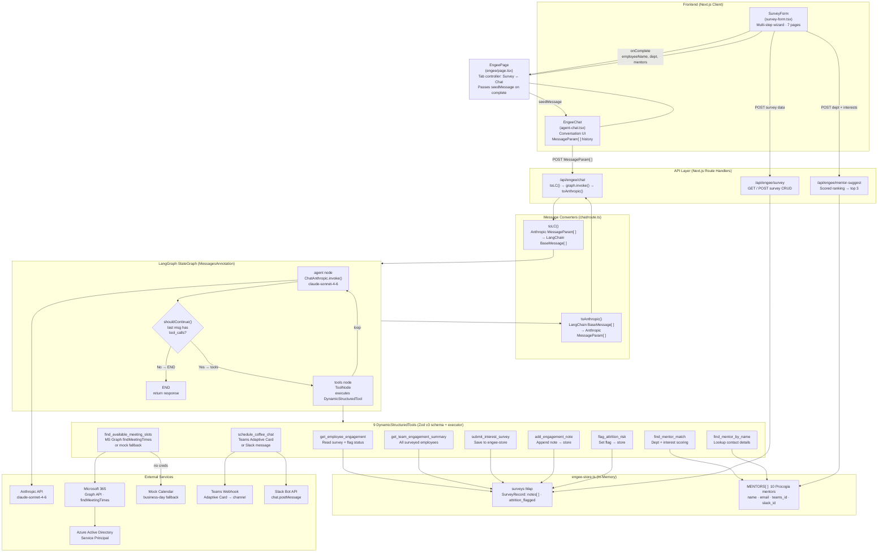

# Engee Agent — Architecture Design

## Overview

Engee is a new hire engagement agent built on **LangGraph** (`@langchain/langgraph`). A `StateGraph` with two nodes — `agent` and `tools` — replaces the custom agentic loop. `ChatAnthropic` (LangChain) drives the LLM; 9 `DynamicStructuredTool` instances (Zod v3 schemas + executors) handle all side effects.

---

## System Architecture Diagram



---

## LangGraph State Machine

```
__start__
    ↓
[ agent node ]  ←─────────────────────┐
  ChatAnthropic.invoke(messages)       │
    ↓                                  │
shouldContinue()                       │
  ├── tool_calls present? → [ tools node ]
  │     ToolNode.invoke() → executes   │
  │     DynamicStructuredTool(s)       │
  │     appends ToolMessage(s) ────────┘
  └── no tool_calls? → END
```

- **State:** `MessagesAnnotation` — accumulates `BaseMessage[]` across all turns
- **No iteration cap** — LangGraph manages the loop; ends when Claude stops calling tools
- **Parallel tool calls** — `ToolNode` executes multiple tool calls concurrently in a single turn

---

## Message Format Bridge

The frontend sends/receives Anthropic wire-format (`MessageParam[]`). LangGraph works with LangChain `BaseMessage[]`. The converters in `chat/route.ts` bridge the two:

| Anthropic (frontend) | LangChain (LangGraph) |
|---|---|
| `{role:"user", content:"text"}` | `HumanMessage("text")` |
| `{role:"assistant", content:"text"}` | `AIMessage("text")` |
| `{role:"assistant", content:[..., {type:"tool_use"}]}` | `AIMessage({ content, tool_calls:[...] })` |
| `{role:"user", content:[{type:"tool_result"},...]}` | `ToolMessage` per result |

Consecutive `ToolMessage`s are grouped back into a single Anthropic user turn on the way out.

---

## Data Flow: New Hire Journey

```
1. New hire opens Engee → Survey tab
2. Completes 7-step survey
3. On submit:
     a. POST /api/engee/survey        → saveSurvey() → engee-store
     b. POST /api/engee/mentor-suggest → findTopMentors() → top 3
4. New hire selects a mentor
5. EngeePage generates seedMessage → switches to Chat tab
6. EngeeChat auto-sends seed message → POST /api/engee/chat
7. chat/route.ts:
     a. toLC()          → convert to LangChain messages + SystemMessage
     b. graph.invoke()  → LangGraph runs agent/tools loop
        • find_mentor_by_name         → mentor contact details
        • find_available_meeting_slots → 3 calendar slots
        • schedule_coffee_chat         → Teams or Slack notification
     c. toAnthropic()   → convert back for frontend storage
8. New hire and mentor notified
```

---

## Mentor Matching Algorithm

`findTopMentors()` in `engee-store.ts`:

| Signal | Points |
|--------|--------|
| Same department | +20 |
| Related department | +8 |
| Professional interest keyword in bio | +4 per match |
| Learning interest keyword in bio | +2 per match |
| Personal interest keyword in bio | +2 per match |

---

## Integration Map

| Service | How Connected | Env Var |
|---------|--------------|---------|
| Anthropic Claude | `ChatAnthropic` (`@langchain/anthropic`) | `ANTHROPIC_API_KEY` |
| engee-store.ts | In-memory `Map` — surveys, notes, flags, mentor roster | — |
| Microsoft 365 | Graph API `findMeetingTimes` | `MICROSOFT_TENANT_ID / CLIENT_ID / CLIENT_SECRET` |
| Microsoft Teams | Incoming Webhook · Adaptive Cards | `TEAMS_WEBHOOK_URL` |
| Slack | Incoming Webhook · formatted text message | `SLACK_WEBHOOK_URL` |

---

## Key Design Decisions

| Decision | Rationale |
|----------|-----------|
| LangGraph `StateGraph` | Replaces custom while loop — graph structure is explicit, extensible to multi-agent supervisor pattern later |
| `DynamicStructuredTool` + Zod v3 | Schema + executor co-located; Zod v3 required for LangChain Core 0.3.x type inference |
| Message format converters | Frontend stays on Anthropic wire format — zero frontend changes; bridge lives only in the route |
| `MessagesAnnotation` state | LangGraph manages full message history including tool calls/results across all loop iterations |
| In-memory store (no external DB) | Self-contained for demo; `Map` is a drop-in swap for Supabase/SQLite without changing callers |
| Teams = webhook · Slack = bot token | Teams webhook is channel-only; Slack bot token enables DMs — both preserved for different org setups |
